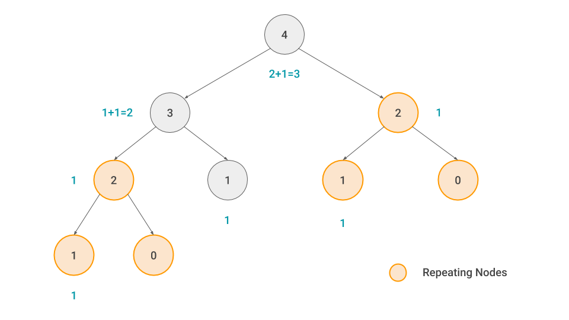
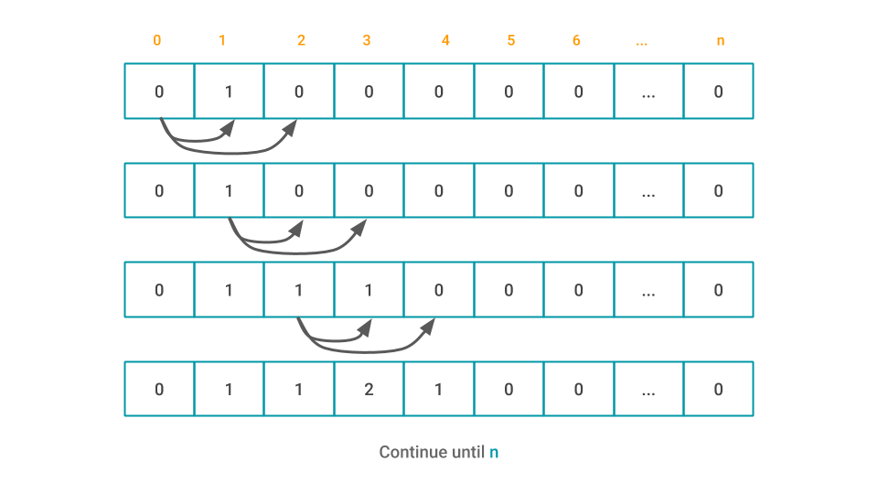
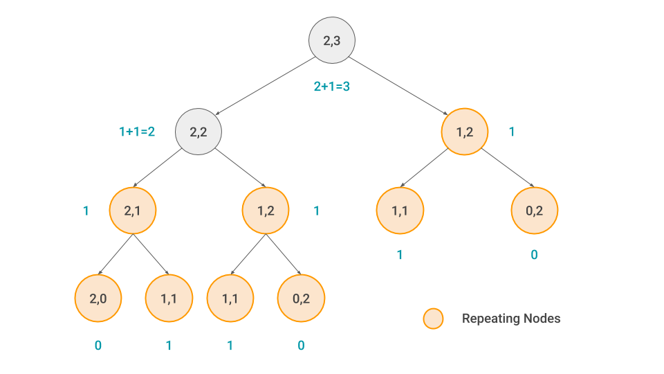
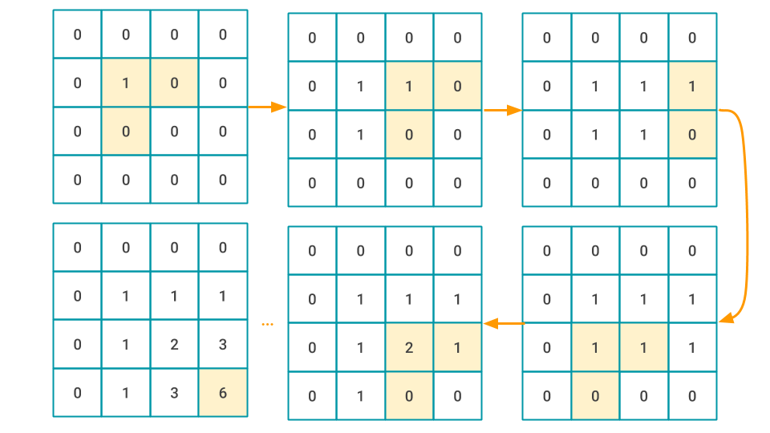
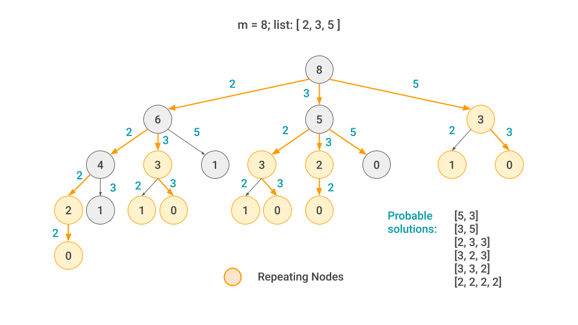
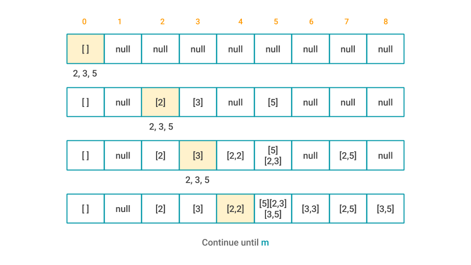
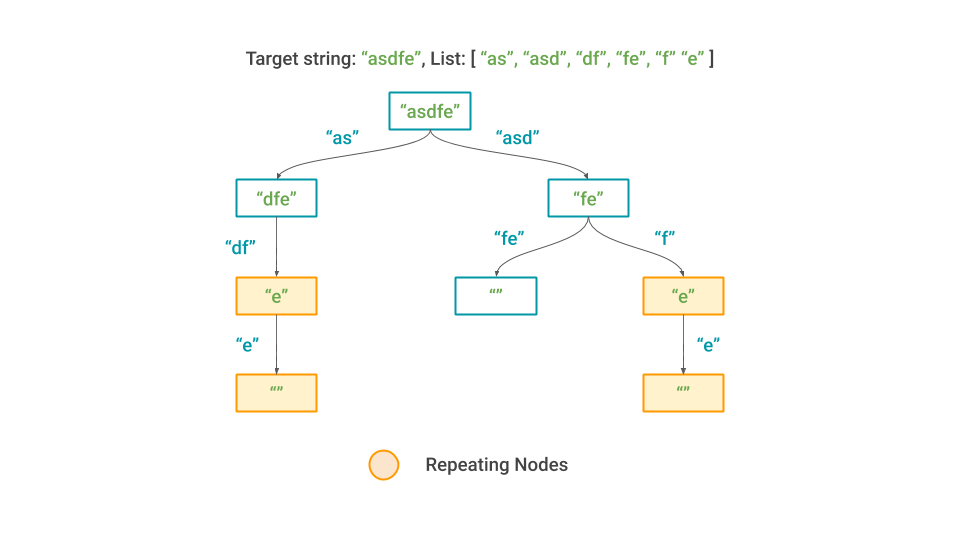
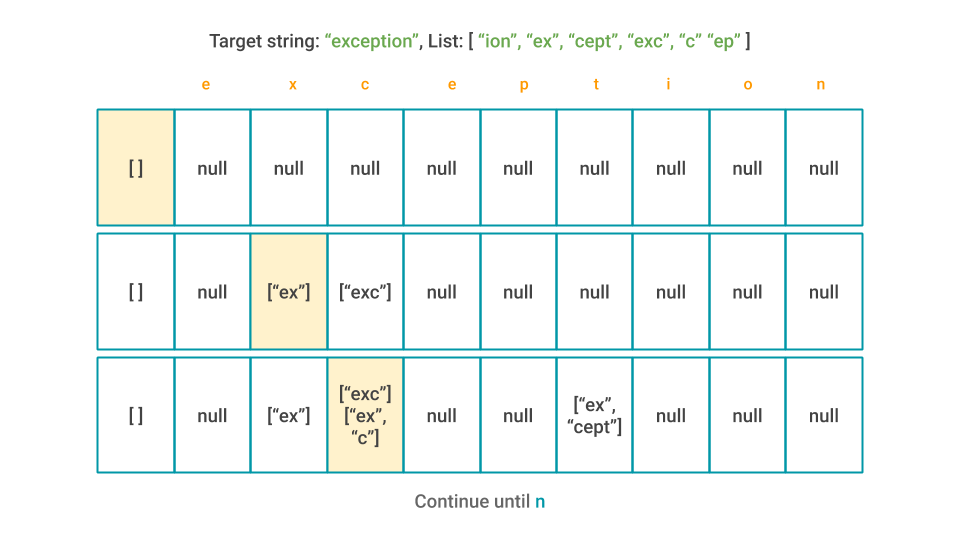

  

<h1 align="center">Dynamic Programming</h1>

Dynamic Programming is mainly an optimization over plain recursion. Wherever we see a recursive solution that has repeated calls for same inputs, we can optimize it using Dynamic Programming. The idea is to simply store the results of subproblems, so that we do not have to re-compute them when needed later. This simple optimization reduces time complexities from exponential to polynomial.

<h3>Fibonacci</h3>

Write a function **fib(n)** that takes in a number as an argument.
The function should return n-th number in the **Fibonacci sequence**.

> The first and second number of the sequence is 1.
>
> To generate the next number in the sequence we add the previous two.
>
> Base case: fib(n) = 1 *for n < 2*
>
> Algorithm: fib(n) = fib(n-1) + fib(n-2)
>
> Brute force recursion time complexity: O(2n).

#### [Memorizarion](/src/recursion/fibonacci/Fibonacci.kt)
- Create a memory object using hash-map or similar data structure
- Store the return values in the hash-map with the input number as key
- In the beginning of every recursion, check for the result in the memory object
- If the result is already there, return; otherwise continue
- Time complexity: **O(n)**

    

#### [Tabulation](/src/tabulation/fibonacci/Fibonacci.kt)

- Create a table of length (n+1). Initialize with 0s
- Seed table by inserting 1 in the 1th element. table[1] = 1
- Iterate through the table and add each element to the next two elements.
- Continue to the end of the table. In the end, **table[n] = fib(n)**

    

<h3>Grid Traveller</h3>

Say that you are traveller on a **2D grid**. You start at the top left conner.
Your goal is to travel to the bottom right corner.
You can only move **down** or **right** 
How many ways can you travel on a **m x n** grid?
Write a function gridTraveller(m, n) that calculates this.

> gridTraveller(1, 1) = 1
>
> gridTraveller(0, n), gridTraveller(m, 0) = 0
>
> gridTraveller(m, n) = gridTraveller(n, m)
>
> Moving right on a m x n grid will result in a (m-1) x n for the next move
>
> Moving down on a m x n grid will result in a m x (n-1) grid for the next move
>
> Time complexity: O(2m+n)

#### [Memorization](src/recursion/grid/GridTraveller.kt)

- Create a memory object using hash-map or similar data structure
- Store the return values in the hash-map with the input number as key
- In the beginning of every recursion, check for the result in the memory object
- If the result is already there, return; otherwise change the grid dimension accordingly and continue
- Time complexity: **O(m x n)**

    

#### [Tabulation](src/tabulation/grid/GridTraveller.kt)

- Create a table with (m + 1) x (n + 1) dimension. Initialize every cell with 0s
- Seed the table by: table[1][1] = 1; since gridTraveller(1, 1) = 1
- Iterate through the table. Add each element to the element on right and down.
- Continue till the bottom right corner. table[m][n] will contain the result
- Time complexity **O(m * n)**

    

<h3>Generate a number from a list of integers</h3>

Given a list of integers with **n** elements, generate a given number, **m** by adding numbers from the list.
A number can be used multiple times. The numbers are non-negative.
This problem can have multiple variations.
1. Can you generate the number from the given list?
2. How many ways can you generate the number from the list?
3. What is the shortest way of generating the number from the list?

> If m is 0, it can be generated regardless of the elements in the list
>
> Keep subtracting the elements until the result is negative
>
> If the final subtraction result is exactly 0, that means the number can be generated
>
> Once got to 0, move up the tree to find the exact sequence of numbers
>   
> Brute force recursion time complexity: O(nm)

#### [Memorization](src/recursion/sum/)

- Create a memory object using hash-map or similar data structure
- Store the return values in the hash-map with the input number as key
- In the beginning of every recursion, check for the result in the memory object
- If the result is already there, return; otherwise continue subtracting until the number gets negative
- For shortest combination problem, time complexity: **O(n x m2)**

    

#### [Tabulation](src/tabulation/sum/)

- Create a table with (m + 1) elements, initialize with null
- Seed the table by setting table[0] = [ ]
- Iterate through the table and for any non-null element iterate through the list of numbers and append the current number, **n** to all the combinations in the current index, **i** and add them all to the **[ i + n ]** index of the table.
- Continue till the current index reaches **m**
- For shortest combination problem, time complexity: **O(n x m2)**

    

<h3>Construct a String from a list of sub-strings</h3>

Given a list of sub-strings with **n** elements, generate a given string, with **m** characters by concatenating sub-strings from the list.
A sub-string can be used multiple times.
This problem can have multiple variations.
1. Can you generate the string from the given list?
2. How many ways can you generate the string from the list?
3. What is the shortest way of generating the string from the list?

> If m is 0, the string can be generated regardless of the elements in the list
>
> If the string starts with a specific sub-string, it can be subtracted from the target string to get a new target string
>
> Keep subtracting the elements when it's still possible
>
> If the final subtraction result is empty string, that means the string can be generated
>
> Once got to empty string, move up the tree to find the exact sequence of sub-strings
>   
> Brute force recursion time complexity: O(nm)

#### [Memorization](src/recursion/construct/)

- Create a memory object using hash-map or similar data structure
- Store the return values in the hash-map with the input number as key
- In the beginning of every recursion, check for the result in the memory object
- If the result is already there, return; otherwise continue subtracting until the string becomes empty
- For all combinations' problem, time complexity: **O(nm)**. STILL, EXPONENTIAL.

    

#### [Tabulation](src/tabulation/construct/)

- Create a table with (m + 1) elements, initialize with null
- Seed the table by setting table[0] = [ ]
- Iterate through the table and for any non-null element iterate through the list of sub-strings and if the current sub-string matches the corresponding sub-string in the target word, append it to all the combinations in the current index, **i** and add them all to the **[ i + n ]** index of the table.
- Continue till the current index reaches **m**
- For all combinations' problem, time complexity: **O(nm)**. STILL, EXPONENTIAL.

    

## License

This work is licensed under [GNU General Public License v3.0](https://github.com/atick-faisal/PIC16F877a/blob/master/LICENSE).